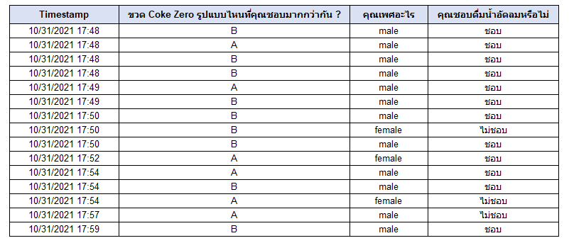
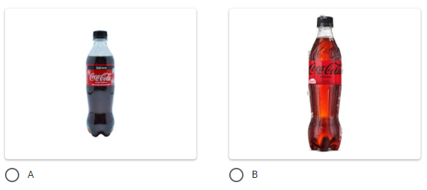
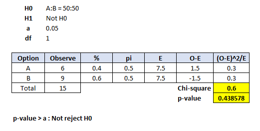
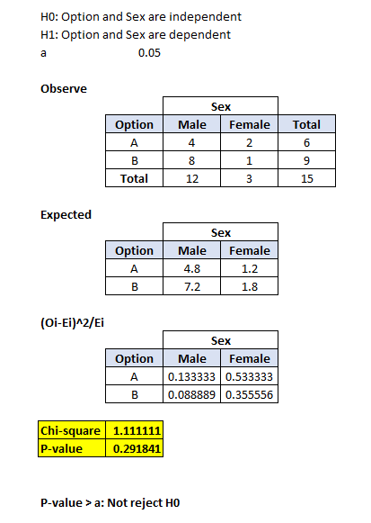
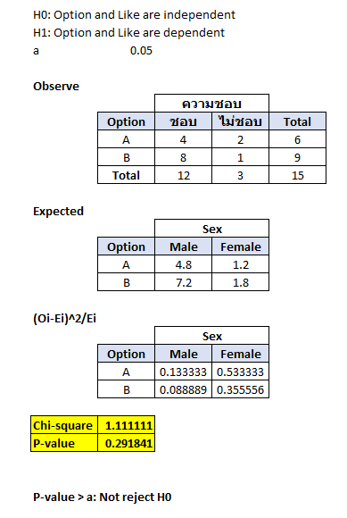

# AB Testing

**Data Set** [Survey In-class](./AB-Testing_Group_3.xlsx)

## Method

### 1. Create Survey for A/B Testing
 

* Gender (Male/Female)
* Like soft drink (Yes/No)

### 2. Using Chi-square to Test statistics

## Result

 **Coke 2 packages not difference**

 **Gender and Option are independent**

 **Like soft drink and Option are independent**

