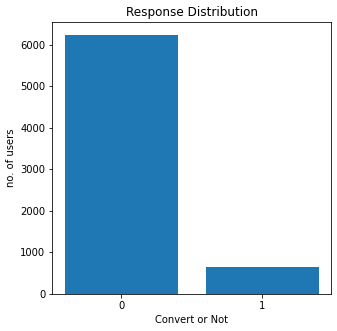
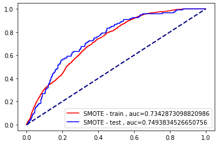

# Campaign Response Model
 

**Data Set** [Retail Data Response](./Retail_Data_Response.csv) & 
[Retail Data Transactions](./Retail_Data_Transactions.csv)

**Note Book** [Campaign Response Model](./Campaign_Response_Model_6310422040_AUC_0_782_AUC_0_741.ipynb)

## Method
---

### 1. Data Preparation

### 2. Calculating response rate (Imbalance)
 

### 3. Creating train and test dataset

### 4. Fixing imbalanced with SMOTE

### 5. Using SVM
 

## Result
---
 

 **SVM have best performance**

*   AUC - train = 0.734
*   AUC - test = 0.749
