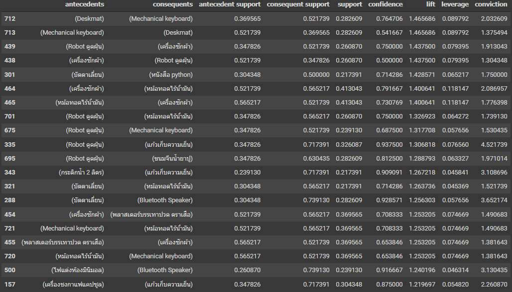
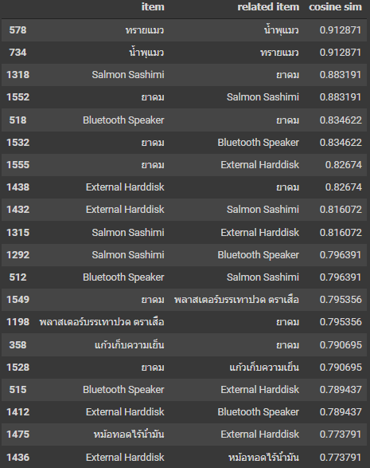

# Cross-selling

**Data Set** [Customer Preference Survey](https://github.com/E4RTTH/BAD7105-CRM-Analytics/blob/main/Cross-selling/Customer%20Preference%20Survey.csv)

**Note Book** [Product Recommendation (Cross-selling)](./ProductRecommendation_6310422040.ipynb)

## Method
---

### 1. Data Preparation

* Drop NULL data
* Change Thai Lang to number (0/1)

### 2. Market Basket
 

### 3. Collaborative Filtering
 

## Result
---
 

 **Market Basket (Top 5) -- (filter: confidence >= 0.5, lift >= 1, support >= 0.2 )**

1.  Mechanical Keyboard --> Deskmat
2.  เครื่องซักผ้า -->  Robot ดูดฝุ่น
3.  หนังสือ python --> บัตตาเลี่ยน
4.  หม้อทอดไร้น้ํามัน --> เครื่องซักผ้า
5.  หม้อทอดไร้น้ํามัน --> Robot ดูดฝุ่น

---

 **Collaborative Filtering (Top 5)**

1.  ทรายแมว & น้ำพุแมว
2.  Salmon Sashimi & ยาดม
3.  Bluetooth Speaker & ยาดม
4.  External Harddisk & ยาดม
5.  External Harddisk & Salmon Sashimi