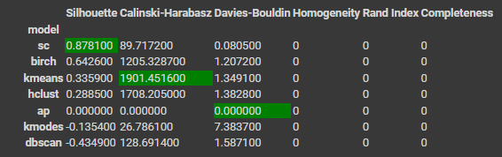
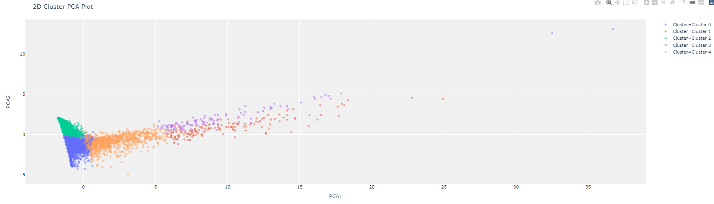
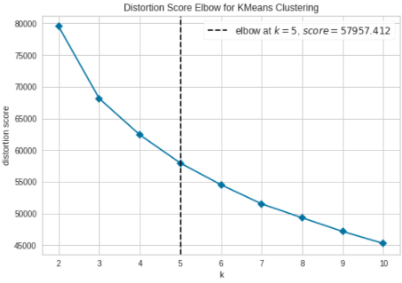
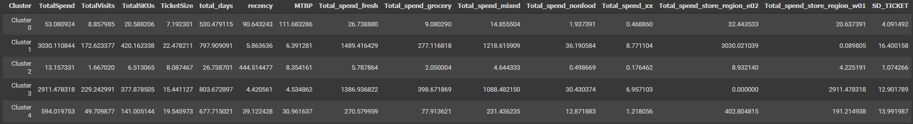

# Customer Segmentation

**Data Set** Supermarket Data

**Note book** [Customer Segmentation](./Customer_Segmentation_Group_10.ipynb)

## Method

### 1. Prepare customer single view
### 2. Cluster customers
### 3. Compare model performance
 

### 4. Kmeans Clustering (5 clusters)
 
    

### 5. Interpret results and plan for actions
 

## Result

**Cluster 0 : Slots**

*  Most Mean time between purchase
*  Least ticket size
*  Frequent visit on monday

#### Action: Ignore them
---

**Cluster 1 : Unicorn**

*   Most spend
*   Most buy various of SKUs
*   Most ticket size
*   Most S.D. spending
*   Most spend fresh
*   Most spend store region e02

#### Action: Privilege
---

**Cluster 2 : Donkey**

*   Least spend
*   Least visit
*   Most recency
*   Least S.D. ticket size

#### Action: Upsell and Discount
---

**Cluster 3 : Pegasus**

*   Most visit
*   Least recency
*   Least Mean time between purchase
*   Have most relationship time with store
*   High S.D. spending
*   Most spend grocery
*   Most spend store region w01

#### Action: Promotion
---

**Cluster 4 : Horse**

*   Middle S.D. spending
*   Middle spend
*   Middle visit

#### Action: Upsell and Discount

